

  
     

## :star: Interface Program
### - DemoQLineEdit.py [gif] - 

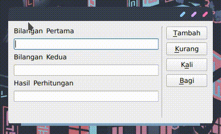

### - DemoQTextEdit.py -

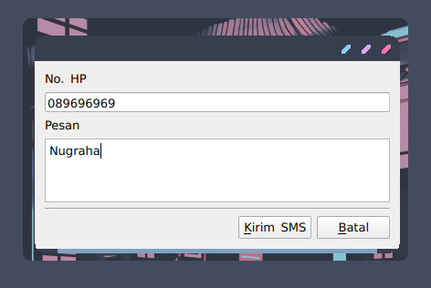

### - DemoQRadioButton.py [gif] -

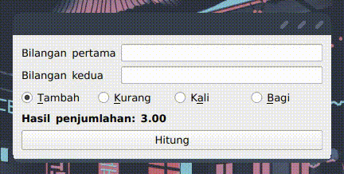

### - DemoQCheckBox.py- 

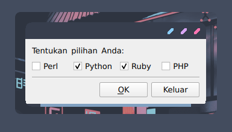

### - DemoQComboBox.py [gif] -

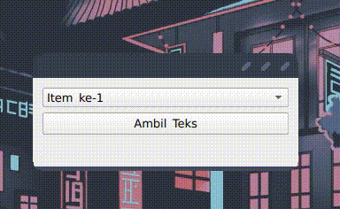

### - DemoQFontComboBox.py [gif] -

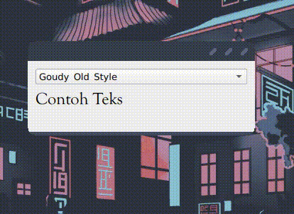

### - DemoQSpinBox.py [gif] -

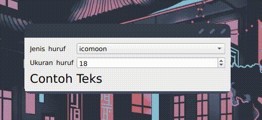

### - DemoQDateTimeEdit.py [gif] -

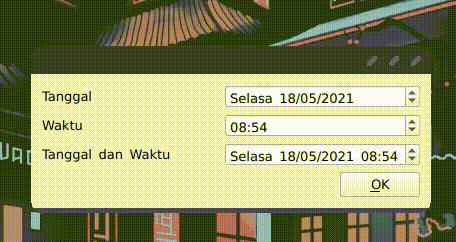

### - DemoQCalendarWidget.py [gif] -

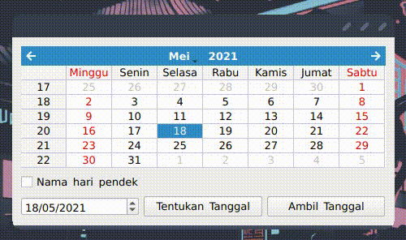

### - DemoQSlider.py [gif] -

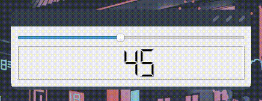

### - DemoQListWidget.py [gif] -

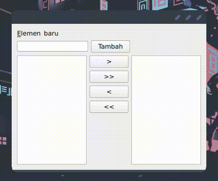

### - DemoQProgressBar.py [gif] -

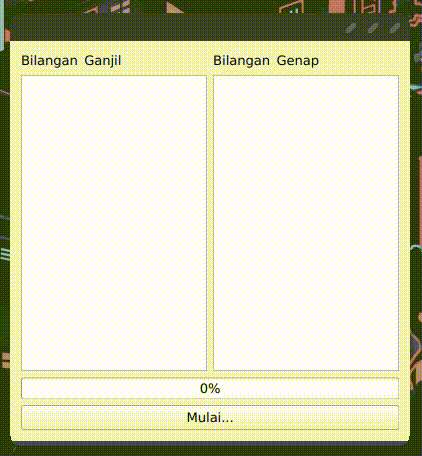
