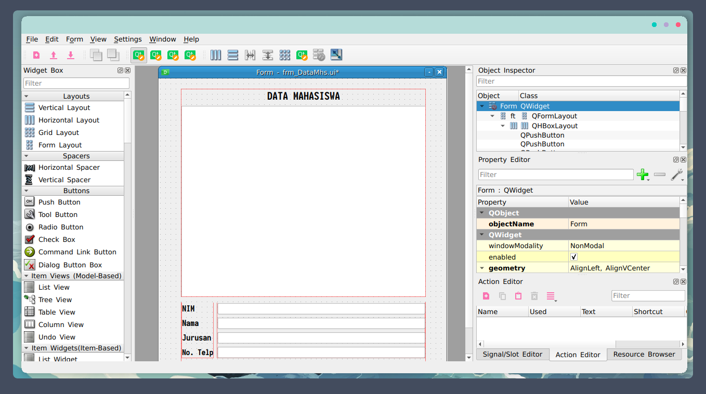
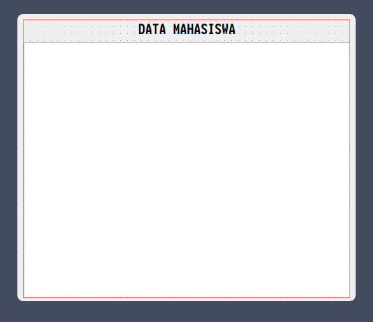
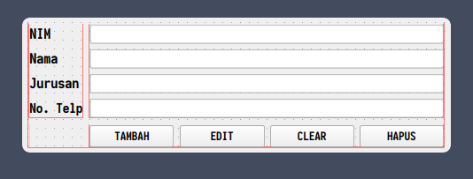
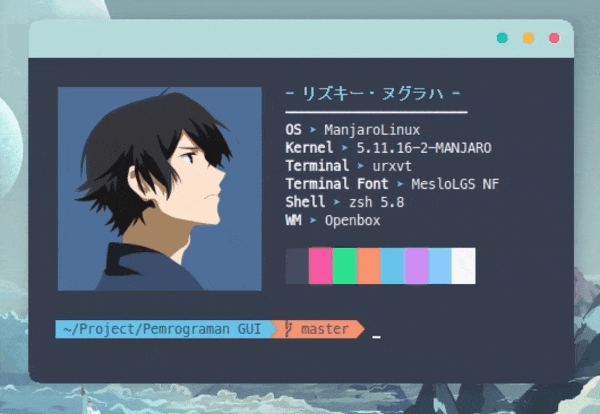
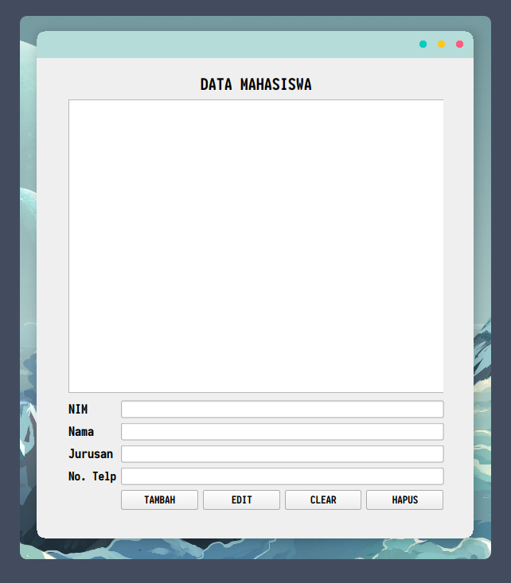

<p align="center">
  <a name="top" href="#octocat-hi-there-thanks-for-visiting-">
     
  </a>
  <br><br><br><br>
</p>

## :star: Tampilan Program Qt-Designer




## :cyclone: Widget yang digunakan
### Komponen 1




<details>
  <summary><kbd>Vertical Layout</kbd></summary>
  
   ```bash
    Berfungsi untuk mengatur tata letak/layout secara vertical ditandai dengan kotak warna merah.
   ```
   
</details>

<details>
  <summary><kbd>Label</kbd></summary>
  
   ```bash
    Berfungsi untuk menampilkan sebuah teks, pada gambar disamping nama labelnya adalah Data Mahasiswa.
   ```
   
</details>


<details>
  <summary><kbd>Plain Text Edit</kbd></summary>
  
   ```bash
    Berfungsi untuk menulis text dgn jumlah karakter yg banyak.
   ```
   
</details>

### Komponen 2



<details>
  <summary><kbd>Form Layout</kbd></summary>
  
   ```bash
    Berfungsi untuk menggabungkan layout-layout lainnya contohnya disini layout vertical dan horizontal.
   ```
   
</details>

<details>
  <summary><kbd>Vertical Layout</kbd></summary>
  
   ```bash
    Berfungsi untuk mengatur tata letak/layout secara vertical ditandai dengan kotak warna merah.
   ```
   
</details>
  
<details>
  <summary><kbd>Horizontal Layout</kbd></summary>
  
   ```bash
    Berfungsi untuk mengatur tata letak/layout secara horizontal ditandai dengan kotak warna merah.
   ```
   
</details>

<details>
  <summary><kbd>Label</kbd></summary>
  
   ```bash
    Berfungsi untuk menampilkan sebuah teks, pada gambar disamping nama labelnya adalah Nim, Nama, Jurusan, dan NoTelp dengan menggunakan layout Vertical.
   ```
   
</details>

<details>
  <summary><kbd>Line Edit</kbd></summary>
  
   ```bash
    Berfungsi untuk mengedit teks dalam satu baris, pada gambar disamping line edit yaitu yang sebelah kanan label dan menggunakan layout Vertical.
   ```
   
</details>

<details>
  <summary><kbd>Push Button</kbd></summary>
  
   ```bash
    Berfungsi untuk tombol yang bisa digunakan untuk konfirmasi atau cancel, pada gambar disamping nama buttonnya yaitu yang tambah, edit ,clear, dan hapus dengan menggunakan    layout Horizontal.
   ```
   
</details>

## :rice_scene: Convert File Ui Qt-Designer ke Python

  1. Save program yang sudah dibuat di Qt-Designer yang berformat .ui
  2. Buka CMD/Terminal (disini saya memakai terminal)
  3. Lalu ketik command berikut pada CMD/Terminal :
  ``` bash
      $ pyuic5 -x 'nama-program-format-.ui' -o 'nama-untuk-file-pythonnya.py'
  ```
  4. Selesai, jika terdapat file python yg sudah diconvert berarti sudah berhasil diconvert

### GIF: Convert .ui ke python




## :star2: Tampilan Output Program

Untuk membuka file python yang sudah diconvert tadi caranya gampang:
  1. Buka CMD/Terminal
  2. Ketik Command berikut pada CMD/Terminal:
  ``` bash
      $ python 'nama-untuk-file-pythonnya.py'
  ```
  3. Selesai, jika berhasil maka akan menampilkan interfacenya.

### GIF: Running Python


## Program Interface


